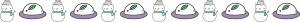
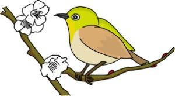
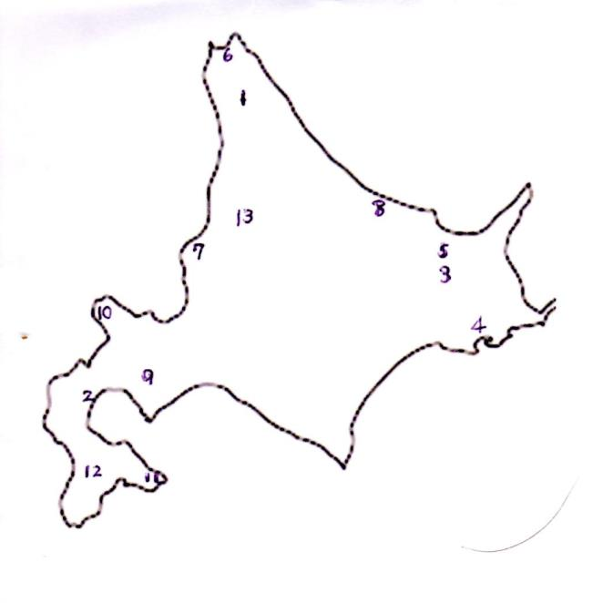

# やまびこ通信2018年2月号
No.123  
2018年2月9日発行

## 1月活動報告
12日 定例会／勉強会  
14日 ユニバーサル部会  
19日 合同ボランティア会  
26日 定例会／勉強会・役員会

## 2月活動予定
2日 周年パネル作成委員会  
4日 ユニバーサル部会  
4日 バリアフリー朗読会  
9日 定例会／勉強会  
15日 東京音訳グループ連絡会・講演会  
16日 合同ボランティア会  
23日 定例会／勉強会

## 〈録音図書(デイジー版CD)作成〉

| 支援室だより第87号 | 30分 |
| 北区図書館情報1月及び北区の部屋だより第102号他 | 1時間30分 |

## 対面音訳

| 1月 | 15件 |
|:--- | ---:|
| 本年度累計 | 136件 |

## ほっと一句
今月も〈十条台句会〉会員の方の俳句をご紹介します。

好物は 熱めの白湯や 初雀

真貴

## 新入会員のひとこと
はじめまして。
まだ何がわからないかもわからないような感じです。
神代と申します。
音訳のサークルに入れていただいた、
と知人に話したところ、
「じゃあこれはどう音訳するの？」と聞かれ、
まだ全く答えられません！本文が全て横書きで、
左右2列になっているという場合、
これを言う説明がいるかや、
どのページにも同じマークがある場合、

いつもマークの説明をするかなど、
１つ1つ学んでいきたいです。

どうぞよろしくお願いいたします。

神代寛子

## Let's&ensp;try!!

寒い日が続きますね。
今月は昔懐かしい暖房具に因んだ漢字の読みを集めてみました。  
読んだだけで暖かくなるといいのですが…。

> 立春を過ぎてもなお<ruby>余寒<rt>(　　)</rt></ruby>の厳しい日々です。
> 
> <ruby>火鉢<rt>(　　)</rt></ruby>の<ruby>熾火<rt>(　　)</rt></ruby>を集め、<ruby>雪達磨<rt>(　　　)</rt></ruby>を作って<ruby>悴<rt>(　　)</rt></ruby>んだ手を<ruby>翳<rt>(　　)</rt></ruby>す。
> 
> 昔は手に<ruby>皹<rt>(　　)</rt></ruby>（<ruby>皸<rt>(　　)</rt></ruby>）や<ruby>霜焼<rt>(　　)</rt></ruby>けができている子供も多かったですね。
> 
> 寒いと恋しくなるのは<ruby>火燵<rt>(　　)</rt></ruby>。室町時代に<ruby>囲炉裏<rt>(　　　)</rt></ruby>の上に<ruby>櫓<rt>(　　)</rt></ruby>を組み、<ruby>蒲団<rt>(　　)</rt></ruby>をかけたのが起源とか。
> 
> 古くは熱源として<ruby>木炭<rt>(　　)</rt></ruby>や<ruby>炭団<rt>(　　)</rt></ruby>（後に<ruby>練炭<rt>(　　)</rt></ruby>、<ruby>豆炭<rt>(　　)</rt></ruby>）などを用いました。
> 
> <ruby>行火<rt>(　　)</rt></ruby>は直接手足に当てて暖を取るもの。 <ruby>湯湯婆<rt>(　　　)</rt></ruby>のように蒲団の<ruby>足下<rt>(　　)</rt></ruby>に入れます。
> 
> さらに小さいものが<ruby>懐炉<rt>(　　)</rt></ruby>。
> 
> ともあれ<ruby>長閑<rt>(　　)</rt></ruby>な春の日が待ち遠しいですね。

(**「足下」**は何と読みましたか？広辞苑には「そっか」とありますが・・・、
さて皆さんのご意見はいかが？)

### 1月の答え

まんべくん  
①おといねっぷ  
②おしゃまんべ  
③てしかが  
④あっけし  
⑤めまんべつ  
⑥わっかない  
⑦ましけ  
⑧おこっぺ  

⑨まっかり  
⑩かもえない  
⑪とどほっけ  
⑫あっさぶ  
⑬わっさむ

## お問い合わせ
定例会：第2・第4金曜日10時～12時／中央図書館3階  
連絡先：やまびこ代表 <ruby>円谷千恵子<rt>（ツムラヤ・チエコ）</rt></ruby> 03（3907）2909

