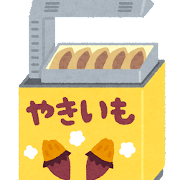

### やまびこ通信2021年11月号

No.168

2021年11月12日発行

### 10月の活動報告

{: .migi}

10月8日(金)
定例会・勉強会

10月10日(日)
ユニバーサル部会

10月22日(金)
定例会・勉強会

10月29日(日)
バリアフリー朗読会 リハーサル

### 11月の活動予定

{: .migi}

11月7日(日)
ユニバーサル部会

11月12日(金)
定例会・勉強会

11月14日(日)
バリアフリー朗読会

11月26日(金)
定例会・勉強会

### 今後の予定

12月3日(金)
東京音訳グループ連絡会 役員会

### 録音図書(デイジー版CD)製作

{: .migi}

1. 
基幹センターだより vol.3
15分

2. 
北区図書館情報10月 及び 北区の部屋だより第146号
55分

3. 
『新版 日本の島ガイド SHIMADAS
8
瀬戸内海の島々（愛媛）
』
8時間20分

### 対面音訳

10月|34時間
|:---|---:|
今年度累計|218時間

### 十条台句会

{: .migi}

<ruby>枯滝<rp>(</rp><rt>かれたき</rt><rp>)</rp></ruby>の <ruby>苔<rp>(</rp><rt>こけ</rt><rp>)</rp></ruby>のしめりや <ruby>秋<rp>(</rp><rt>あき</rt><rp>)</rp></ruby>の<ruby>声<rp>(</rp><rt>こえ</rt><rp>)</rp></ruby>

<ruby>真貴<rp>(</rp><rt>まき</rt><rp>)</rp></ruby>

### 北区の中の 「音訳グループやまびこ」 その1

#### 活動報告や予定にある ユニバーサル部会とは？

{: .migi}

北区図書館活動区民の会の 組織の一部です。
図書館職員と協議し 活動しています。

やまびこからは 部会に
会長、 副会長が参加しています。

部会は
「企画・広報部」・
「子ども部」・
「ユニバーサル部」・
「地域資料部」・
「ドナルド・キーン研究部」です。

ユニバーサル部の構成は

団体会員・・・
音訳グループやまびこ・点訳グループ六星会・点訳サークル六星会・北区手話サークル。

個人会員・・・
バリアフリー映画 ガイド字幕作成です。

活動は、
障害のある方や高齢者をはじめ、
図書館の利用が困難な方々を支援することにより、
「誰もが等しく利用しやすい図書館」への取り組みを進めてゆくことを目的としています。

主な活動として、
図書館が 必要なサービスを行う上で
利用者の立場にたった提言や、
実際の利用時の フロアーワークの充実に繋がる活動を行っていきます。

#### 活動内容

- 年4回バリアフリー映画会開催
- 年1回バリアフリー朗読会開催  
  11月14日(日) バリアフリー朗読会も、北区図書館活動区民の会主催です。
- 本の音訳と点訳
- 広報誌等の点訳と音訳  
  （ぽけっと、北区の部屋だより、図書館情報など）
- 自動販売機の点字シール作成  
  サポートや 設備等の確認作業
- 朗読会やイベントなどへの 手話通訳者派遣
- サポートデスクの運営
- 子どもの本のつどい in Kitakuへの参加
- 図書館内での、障害のある方々の避難訓練のサポートや設備等の確認作業

### Let's try!

{: .migi}

#### 11月の問題

先月に続き読み方の違う熟語です。
（ ）の数だけ 読んでみましょう。

<blockquote markdown="1">
(1) <ruby>明日<rp>(</rp><rt>（　　　）</rt><rp>)</rp></ruby> <ruby>明日<rp>(</rp><rt>（　　　）</rt><rp>)</rp></ruby> <ruby>明日<rp>(</rp><rt>（　　　）</rt><rp>)</rp></ruby>

(2) <ruby>下手<rp>(</rp><rt>（　　　）</rt><rp>)</rp></ruby> <ruby>下手<rp>(</rp><rt>（　　　）</rt><rp>)</rp></ruby> <ruby>下手<rp>(</rp><rt>（　　　）</rt><rp>)</rp></ruby>

(3) <ruby>最中<rp>(</rp><rt>（　　　）</rt><rp>)</rp></ruby> <ruby>最中<rp>(</rp><rt>（　　　）</rt><rp>)</rp></ruby> <ruby>最中<rp>(</rp><rt>（　　　）</rt><rp>)</rp></ruby>

(4) <ruby>見物<rp>(</rp><rt>（　　　）</rt><rp>)</rp></ruby> <ruby>見物<rp>(</rp><rt>（　　　）</rt><rp>)</rp></ruby>

(5) <ruby>寒気<rp>(</rp><rt>（　　　）</rt><rp>)</rp></ruby> <ruby>寒気<rp>(</rp><rt>（　　　）</rt><rp>)</rp></ruby>

(6) <ruby>足跡<rp>(</rp><rt>（　　　）</rt><rp>)</rp></ruby> <ruby>足跡<rp>(</rp><rt>（　　　）</rt><rp>)</rp></ruby>

(7) <ruby>気質<rp>(</rp><rt>（　　　）</rt><rp>)</rp></ruby> <ruby>気質<rp>(</rp><rt>（　　　）</rt><rp>)</rp></ruby>

(8) <ruby>明後日<rp>(</rp><rt>（　　　）</rt><rp>)</rp></ruby> <ruby>明後日<rp>(</rp><rt>（　　　）</rt><rp>)</rp></ruby>

(9) <ruby>十八番<rp>(</rp><rt>（　　　）</rt><rp>)</rp></ruby> <ruby>十八番<rp>(</rp><rt>（　　　）</rt><rp>)</rp></ruby>

(10) <ruby>意気地<rp>(</rp><rt>（　　　）</rt><rp>)</rp></ruby> <ruby>意気地<rp>(</rp><rt>（　　　）</rt><rp>)</rp></ruby>

(11) <ruby>競売<rp>(</rp><rt>（　　　）</rt><rp>)</rp></ruby> <ruby>競売<rp>(</rp><rt>（　　　）</rt><rp>)</rp></ruby>

</blockquote>

### 10月の答え

<blockquote markdown="1">
(1) 
<ruby>小人数<rp>(</rp><rt>こにんずう</rt><rp>)</rp></ruby>

(2) 
<ruby>少人数<rp>(</rp><rt>しょうにんずう</rt><rp>)</rp></ruby>

(3) 
<ruby>美味<rp>(</rp><rt>おい</rt><rp>)</rp></ruby>しい

(4) 
<ruby>美味<rp>(</rp><rt>うま</rt><rp>)</rp></ruby>い

(5) 
<ruby>出端<rp>(</rp><rt>ではな</rt><rp>)</rp></ruby>

(6) 
<ruby>出鼻<rp>(</rp><rt>でばな</rt><rp>)</rp></ruby>

(7) 
<ruby>同右<rp>(</rp><rt>どうみぎ</rt><rp>)</rp></ruby>

(8) 
<ruby>同左<rp>(</rp><rt>どうひだり</rt><rp>)</rp></ruby>

(9) 
<ruby>文目<rp>(</rp><rt>あやめ</rt><rp>)</rp></ruby>

(10) 
<ruby>偶<rp>(</rp><rt>たま</rt><rp>)</rp></ruby>さか

</blockquote>

定例会：
第2・第4金曜日10時～12時
／北区立中央図書館3階  

連絡先：
音訳グループやまびこ代表 大川 薫  

電話番号：
03-3910-7331  

<a data-dur="5.93" data-begin="363.465" id="xmri_0084" markdown="1" href="mailto:ymbk2016ml@gmail.com?Subject=やまびこウェブサイトについて">このサイトについてはこちらへ</a>

