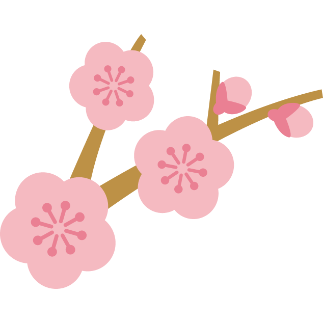

## やまびこ通信2022年2月号

No.171

2022年2月11日発行

{: .migi}

### 1月の活動報告

1月9日(日) ユニバーサル部会

1月14日(金) 定例会・勉強会

1月28日(金) 定例会・勉強会

### 2月の活動予定

2月11日(金) 定例会・勉強会

2月13日(日) ユニバーサル部会

2月25日(金) 定例会・勉強会

### 今後の予定

2月25日～3月31日 ユニバーサル部 パネル展示

3月6日(日) バリアフリー映画会

### 録音図書 (デイジー版CD) 製作

{: .migi}

基幹センターだより
16分

連盟だより第46号
copy 

ラジオで! カムカムエヴリバディ1月号
3時間

北区の歴史「はじめの一歩」滝野川東地区編
6時間30分

北区図書館情報2022年1月及び北区の部屋だより149号
55分

### 対面音訳

{: .migi}

1月|53時間
|:---|---:|
今年度累計|375時間

### 十条台句会

シナモンの <ruby>効<rp>(</rp><rt>き</rt><rp>)</rp></ruby>きし<ruby>焼<rp>(</rp><rt>や</rt><rp>)</rp></ruby>き<ruby>菓子<rp>(</rp><rt>がし</rt><rp>)</rp>
 </ruby><ruby>日脚<rp>(</rp><rt>ひあし</rt><rp>)</rp></ruby><ruby>伸<rp>(</rp><rt>の</rt><rp>)</rp></ruby>ぶ

<ruby>真貴<rp>(</rp><rt>まき</rt><rp>)</rp></ruby>

### Let's try!

{: .migi}

#### 2月の問題

<blockquote markdown="1">
(1) <ruby>一向<rp>(</rp><rt>（　　　）</rt><rp>)</rp></ruby>

(2) <ruby>二乗<rp>(</rp><rt>（　　　）</rt><rp>)</rp></ruby>

(3) <ruby>凡百<rp>(</rp><rt>（　　　）</rt><rp>)</rp></ruby>

(4) <ruby>長閑<rp>(</rp><rt>（　　　）</rt><rp>)</rp></ruby>

(5) <ruby>左見右見<rp>(</rp><rt>（　　　）</rt><rp>)</rp></ruby>

(6) <ruby>食<rp>(</rp><rt>（　　　）</rt><rp>)</rp></ruby>み<ruby>出<rp>(</rp><rt>（　　　）</rt><rp>)</rp></ruby>す

(7) <ruby>思<rp>(</rp><rt>（　　　）</rt><rp>)</rp></ruby>しい

(8) <ruby>夜夜中<rp>(</rp><rt>（　　　）</rt><rp>)</rp></ruby>

(9) <ruby>先<rp>(</rp><rt>（　　　）</rt><rp>)</rp></ruby>ず

(10) <ruby>何人<rp>(</rp><rt>（　　　）</rt><rp>)</rp></ruby>たりとも
</blockquote>

1月の解答

<blockquote markdown="1">

(1) <ruby>一段落<rp>(</rp><rt>いちだんらく</rt><rp>)</rp></ruby>
<ruby>一区切<rp>(</rp><rt>ひとくぎ</rt><rp>)</rp></ruby>り

(2) <ruby>茨城<rp>(</rp><rt>いばらき</rt><rp>)</rp></ruby>産の野菜は美味しい。

(3) <ruby>西表島<rp>(</rp><rt>いりおもてじま</rt><rp>)</rp></ruby>には固有種がいる。

(4) <ruby>会釈<rp>(</rp><rt>えしゃく</rt><rp>)</rp></ruby>
<ruby>解釈<rp>(</rp><rt>かいしゃく</rt><rp>)</rp></ruby>

(5) <ruby>河川敷<rp>(</rp><rt>かせんしき</rt><rp>)</rp></ruby>は、
「<ruby>河川敷<rp>(</rp><rt>かせんじき</rt><rp>)</rp></ruby>」でも良い 
(NHK放送文化研究所) が、
<ruby>上敷<rp>(</rp><rt>うわしき</rt><rp>)</rp></ruby>きは <ruby>敷<rp>(</rp><rt>さじき</rt><rp>)</rp></ruby>と違う

(6) 業務を<ruby>完遂<rp>(</rp><rt>かんすい</rt><rp>)</rp></ruby>できた。

(7) <ruby>琴線<rp>(</rp><rt>きんせん</rt><rp>)</rp></ruby>に<ruby>触<rp>(</rp><rt>ふ</rt><rp>)</rp></ruby>れるような経験をして
<ruby>涙腺<rp>(</rp><rt>るいせん</rt><rp>)</rp></ruby>が<ruby>緩<rp>(</rp><rt>ゆる</rt><rp>)</rp></ruby>んだ

(8) <ruby>奇<rp>(</rp><rt>く</rt><rp>)</rp></ruby>しくも今日は先生の<ruby>命日<rp>(</rp><rt>めいにち</rt><rp>)</rp></ruby>です

(9) <ruby>言質<rp>(</rp><rt>げんち</rt><rp>)</rp></ruby>を<ruby>取<rp>(</rp><rt>と</rt><rp>)</rp></ruby>る

(10) <ruby>声<rp>(</rp><rt>こえ</rt><rp>)</rp></ruby>を<ruby>荒<rp>(</rp><rt>あら</rt><rp>)</rp></ruby>らげる

(11) <ruby>極彩色<rp>(</rp><rt>ごくさいしき</rt><rp>)</rp></ruby>の<ruby>絹本<rp>(</rp><rt>けんぽん</rt><rp>)</rp></ruby>仏画

(12) <ruby>角館<rp>(</rp><rt>かくのだて</rt><rp>)</rp></ruby>の足王さんは足の神さまで
参拝すると<ruby>御利益<rp>(</rp><rt>ごりやく</rt><rp>)</rp></ruby>がある。
</blockquote>

定例会: 
第2・第4金曜日10時～12時
／北区立中央図書館3階  

連絡先: 
音訳グループやまびこ代表 大川 薫  

電話番号: 
03-3910-7331  

<a data-dur="5.93" data-begin="227.617" id="xmri_0048" markdown="1" href="mailto:ymbk2016ml@gmail.com?Subject=やまびこウェブサイトについて">このサイトについてはこちらへ</a>

